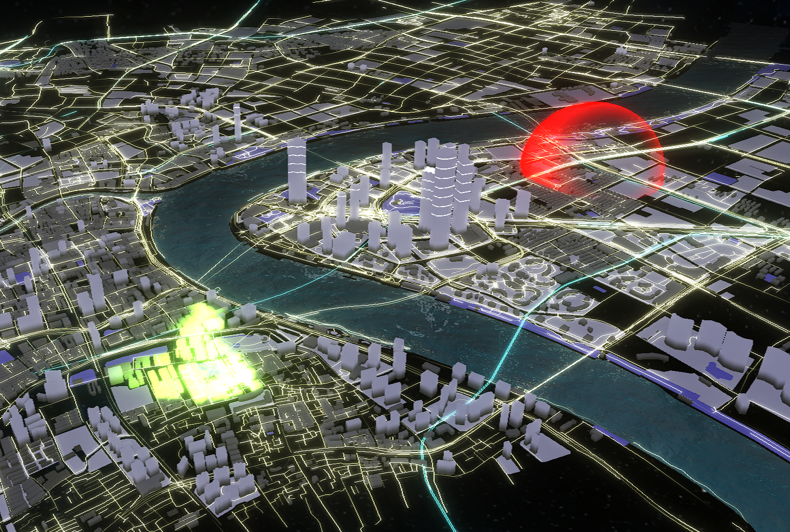
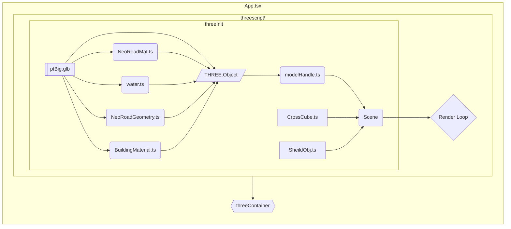

## 3DigitalCity

使用 Threejs 复现常见数字城市效果的 demo


## 准备工作

### 配置

初始化

```
npm install | yarn
```

运行

```
npm run dev | yarn dev
```

编译为 JS

- 目标目录 \built

```
npm run tscomp | yarn tscomp
```

### 资源文件

路径

```
public\terminal3D\*
```

默认示例的文件

```
ptBig.glb //模型文件
sky2.png //天空盒文件
```

### 模型生成工具

- Blender
- [Blender GIS](https://github.com/vvoovv/blender-osm)
- [插件使用教程](https://zhuanlan.zhihu.com/p/421156296)
- 导入项目
  - 生成城市模型后通过 Blender 导出 `.glb` 文件
  - 使用 BlenderGIS 生成的模型会自动分层，取决于在插件中 `Get OSM` 界面选择拉取的数据图层
  - 本项目使用的图层
    - building
    - highway
    - railway
    - waterway
    - natural
    - landuse
    - leisure
  - 导出的模型中各类图层名为`Ways*`线框对象、 `Areas*`模型对象
  - 模型在本项目中通过`src\threescript\modelHandle.ts`中的`handlerFunc`函数进行解析，详见各模块具体功能

## 项目结构



#### App.tsx

处理外部数据输入并导出核心 React 组件

#### three.main.ts

负责整合画布 DOM 初始化以后的所有渲染准备然后处理渲染循环

- 20-61 资源载入和场景配置
- 61-181 后处理效果初始化
- 181-212 渲染循环配置

返回值为通过闭包暴露给外界的可配置对象的操作函数，包括雷达和半球

#### modelHandle.ts

负责对 Blender 导出模型的解析处理
通过对特定模型图层材质和多边形作解析，来生成达成展示效果的模型对象

- modelHandle：主函数
- handlerFunc：模型字段-解析函数的映射表
- genrateNeoRoad：生成道路流光模型的辅助函数

返回一个包含处理后的模型 THREE.group 对象用于展示

#### 模型与材质

- buildingMat.ts

- NeoRoadGeometry.ts

- NeoRoadMat.ts

- sheildObj.ts

- water.ts

各类效果的实现代码，组织形式为 `THREE.Object<Geometry,Material>`
最终并入`modelHandle`的返回对象中作为场景的一部分进行渲染
均使用`THREE.ShaderMaterial`,着色器相关可以参考[shaders and glsl](https://webglfundamentals.org/webgl/lessons/zh_cn/webgl-shaders-and-glsl.html)

## 效果实现

### 流光效果 NeoRoad\*.ts

- 动画逻辑
  - 对道路线条按照时间进行周期性的透明度变化
  - 将道路上各点在周期中的位置进行预处理，随同时间、几何数据一起送入渲染管线，在片段着色器中计算对应透明度
- 实现方法
  - 将道路的三维数据导入到`NeoRoadGeometry.ts`中,由函数`roadPercentGenrator`进行预处理，生成各点的在周期上的位置
  - 在 Shader 中计算最终效果
  - 核心代码(vlength:像素动画周期的偏移量,cycles:周期的长度/单位距离,tailSize:发光部分相对长度/比例)：
    ```glsl
    opacity += abs(max(mod(time * speeds + vlength, cycles) / cycles - tailSize, 0.0) / (1.0 - tailSize));
    ```

### 区域选择效果 sheildObj.ts

- 菲涅尔效应
  - 现实世界中视线垂直于表面时，光反射较弱，而当视线非垂直表面时，夹角越小，反射越明显。
- 实现方法
  - 利用 THREE 自带球体生成函数`THREE.SphereGeometry`生成模型
  - 用`THREE.Geometry.computeVertexNormals`计算模型法线
  - 将物体法线送入着色器，配合当前相机的视角信息计算结果
    - 核心代码(vnormal:像素位置的模型法线,dot:点积函数,opacityBase:透明度阈值):
      ```glsl
      float vecDot = 1.0 - abs(dot(normalize(vnormal),vec3(0.0,0.0,1.0)));
      opacity = (vecDot-opacityBase)/(1.0-opacityBase);
      ```
    - 片元着色器空间已经被归一化，视角向量为(0,0,1)
    - 通过点积计算夹角

### 扫描效果 buildingMat.ts

- 对一定区域以扇形动画进行周期性变化
- 实现方法
  - 核心代码
    ```glsl
    vec3 direction = position - scaningCenter;
    float degree = degrees(atan(-direction.z,direction.x));
    degree=step(0.0,degree)*degree+step(degree,0.0)*(360.0+degree);
    float delta = mod(time * scaningSpeed-degree,360.0);
    scaningPow = step(distance(position,scaningCenter),scaningRadius)*(step(delta,60.0)*(60.0-delta)/60.0);
    ```
  - 针对渲染对象计算与扫描点中心的相对向量`direction`
  - 通过向量计算世界空间的方位角`degree`,并归一化
  - 计算动画与当前渲染对象的角度差`delta`，决定是否被扫描覆盖
  - 最后得到渲染对象的扫描强度(扫描颜色权重)`scaningPow`

### 水面效果 water.ts

- 理论效果
  - 对水面渲染时计算采样反射光线目标的颜色，通过一张滚动的波浪法线贴图扰动光线模拟水波纹效果
- 实现方法
  - 利用`THREE.Object`对象在渲染流程中的钩子函数`onBeforeRender`提前渲染反射空间贴图
  - 核心代码
    ```glsl
    vec4 noise = getNoise( worldPosition.xz * size );
    vec3 surfaceNormal = normalize( noise.xzy * vec3( 1.5, 1.0, 1.5 ) );
    //...
    vec2 distortion = surfaceNormal.xz * ( 0.001 + 1.0 / distance ) * distortionScale;
    vec3 reflectionSample = vec3( texture2D( mirrorSampler, mirrorCoord.xy / mirrorCoord.w + distortion ) );
    ```
- 将相机位置通过水面平面镜像一个水面相机进行采样得到 `mirrorSampler`
- 通过对一张特制的波纹法线图片 noise 采样得到水面法线 `surfaceNormal`
- 在实际绘制水面时配合波纹贴图采样水面相机的结果，输出为最终结果

### 泛光效果

- 针对发光物体进行泛光的特效处理
- 屏幕空间后处理
  - 将需要泛光的物体单独渲染为一张纹理，对此纹理进行形态处理和模糊处理，然后叠加到普通渲染的结果上
